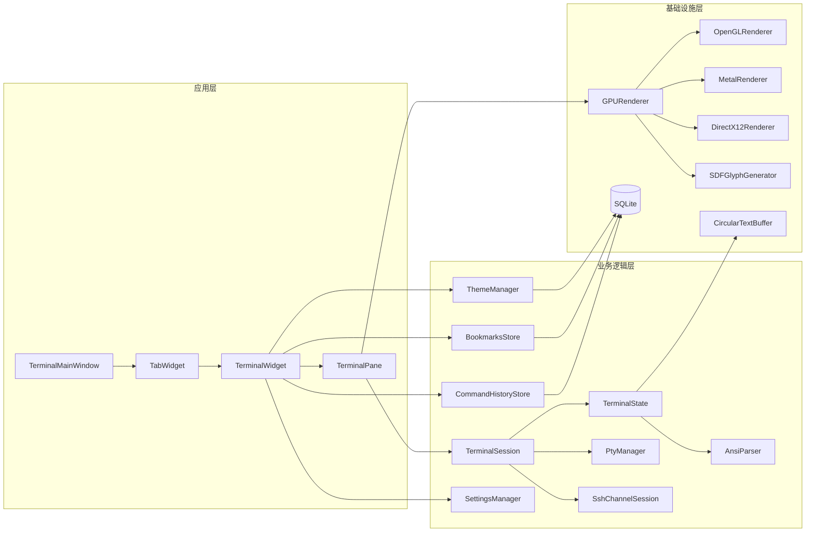
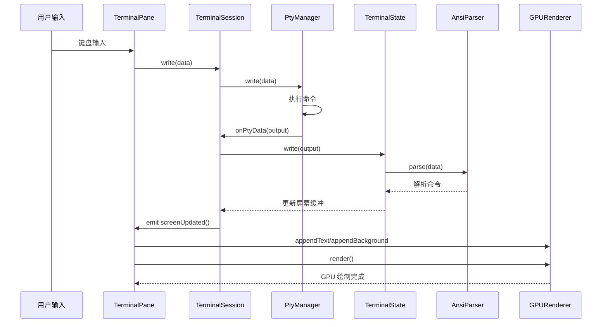

# WindTerm-Extensions 系统架构

## 概述

WindTerm-Extensions 是一个基于 Qt5 的跨平台 GPU 加速终端模拟器，继承自 WindTerm 项目并进行了大量增强开发。项目采用三层架构设计，使终端用户能够享受高性能的终端渲染体验，同时提供 SSH 远程连接、主题系统、Tab 管理、命令历史搜索、书签管理和配置导入导出等丰富的业务功能。

系统支持多后端 GPU 渲染（OpenGL 3.3、Metal、DirectX12、Vulkan），使用 SDF（Signed Distance Field）技术实现高质量抗锯齿字体渲染。所有业务数据采用独立的 SQLite 数据库进行本地持久化存储。

## 技术栈

**语言与运行时**
- C++17

**框架**
- Qt5 (Core, Gui, Widgets, OpenGL, Sql)
- libssh (SSH2 协议)

**渲染后端**
- OpenGL 3.3 Core Profile (跨平台)
- Metal (macOS)
- DirectX12 (Windows)
- Vulkan (Linux, 预留)

**数据存储**
- SQLite (本地持久化)

**构建系统**
- CMake 3.16+

**第三方库**
- Onigmo (正则表达式引擎)

## 项目结构

```
WindTerm-Extensions/
├── CMakeLists.txt                          # 主构建配置
├── src/                                    # 源代码
│   ├── Renderer/                           # GPU 渲染引擎模块
│   ├── Buffer/                             # 环形文本缓冲区
│   ├── Terminal/                           # 终端核心模块
│   ├── Widget/                             # UI 控件模块
│   ├── Theme/                              # 主题系统模块
│   ├── Ssh/                                # SSH 远程连接模块
│   ├── CommandHistory/                     # 命令历史模块
│   ├── Bookmarks/                          # 书签模块
│   ├── MemoryFragment/                     # 记忆碎片模块
│   ├── Settings/                           # 设置管理模块
│   ├── Protocols/                          # 协议模块
│   ├── Pty/                                # PTY 跨平台实现
│   ├── plugins/                            # 插件系统
│   ├── AiIntegration/                      # AI 集成模块
│   ├── Utility/                            # 工具模块
│   ├── libssh/                             # libssh 第三方库
│   └── Onigmo/                             # Onigmo 正则表达式库
├── tests/                                  # 单元测试
├── scripts/                                # Python 辅助脚本
└── .monkeycode/docs/                       # 项目文档
```

**入口点**
- `src/Widget/main.cpp` - 应用启动入口
- `src/Widget/TerminalMainWindow.cpp` - 主窗口
- `CMakeLists.txt` - CMake 构建配置

## 子系统

### GPU 渲染引擎 (Renderer)
**目的**: 高性能终端内容渲染  
**位置**: `src/Renderer/`  
**关键文件**: `GPURenderer.h`, `OpenGLRenderer.cpp`, `SDFGlyphGenerator.cpp`  
**依赖**: Qt5::OpenGL, 平台图形 API  
**被依赖**: TerminalPane, TerminalWidget

### 终端核心 (Terminal)
**目的**: 终端状态管理和 ANSI 解析  
**位置**: `src/Terminal/`  
**关键文件**: `AnsiParser.cpp`, `TerminalState.cpp`, `TerminalSession.cpp`  
**依赖**: PtyManager, CircularTextBuffer  
**被依赖**: TerminalPane

### UI 控件 (Widget)
**目的**: 用户界面和交互  
**位置**: `src/Widget/`  
**关键文件**: `TerminalMainWindow.cpp`, `TerminalWidget.cpp`, `TerminalPane.cpp`  
**依赖**: 所有业务模块  
**被依赖**: windterm-terminal (可执行文件)

### 业务模块
**目的**: 提供 SSH、主题、历史、书签等功能  
**位置**: `src/Ssh/`, `src/Theme/`, `src/CommandHistory/`, `src/Bookmarks/`  
**关键文件**: 各模块 Store/Manager 类  
**依赖**: Qt5::Sql (SQLite)  
**被依赖**: TerminalWidget, Dialogs

## 系统架构图



## 数据流时序图


