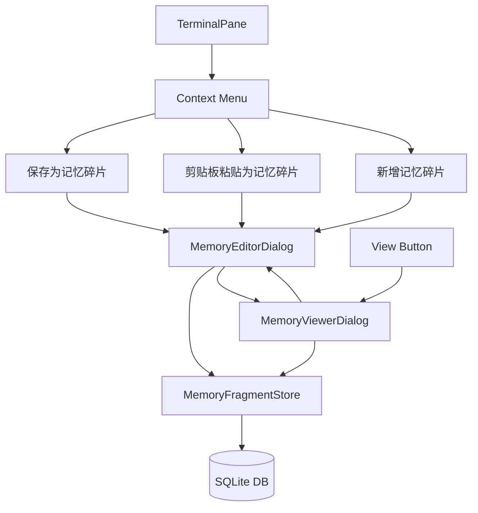

# Memory Fragments

Feature Name: memory-fragments
Updated: 2026-05-20

## Description

"记忆碎片" (Memory Fragments) 允许用户保存、查看和编辑终端会话中的知识片段。用户可以从终端选择文字保存、从剪贴板创建、或手动输入笔记，系统自动捕获完整的上下文元数据。

## Architecture



## Components and Interfaces

### MemoryFragment (Data Model)

```cpp
struct MemoryFragment {
    qint64 id;                    // Primary key, auto-increment
    QString title;                // Fragment title
    QString content;              // Main content
    QString terminalType;         // e.g., bash, zsh, cmd, powershell
    QString workingDirectory;     // Current working directory
    QString sessionId;            // Session identifier
    QString commandHistory;       // Last 10 commands, newline separated
    QString sourceType;           // selection, clipboard, manual
    QString sourceRemark;         // Source description
    QDateTime createdAt;          // Creation timestamp
    QDateTime updatedAt;          // Last update timestamp
};
```

### MemoryFragmentStore (Storage Layer)

```cpp
class MemoryFragmentStore : public QObject {
    Q_OBJECT
public:
    explicit MemoryFragmentStore(QObject* parent = nullptr);
    
    bool initialize(const QString& dbPath);
    
    qint64 createFragment(const MemoryFragment& fragment);
    bool updateFragment(const MemoryFragment& fragment);
    bool deleteFragment(qint64 id);
    
    QList<MemoryFragment> loadAll();
    QList<MemoryFragment> search(const QString& keyword);
    MemoryFragment getFragment(qint64 id);
    
    qint64 count() const;
    
signals:
    void fragmentCreated(qint64 id);
    void fragmentUpdated(qint64 id);
    void fragmentDeleted(qint64 id);
    void databaseError(const QString& error);
    
private:
    QSqlDatabase m_database;
    bool m_initialized;
};
```

### MemoryViewerDialog (History Viewer)

```cpp
class MemoryViewerDialog : public QDialog {
    Q_OBJECT
public:
    explicit MemoryViewerDialog(MemoryFragmentStore* store, QWidget* parent = nullptr);
    
signals:
    void editRequested(qint64 id);
    void deleteRequested(qint64 id);
    
private:
    void loadFragments();
    void setupUI();
    
    MemoryFragmentStore* m_store;
    QListWidget* m_fragmentList;
    QTextEdit* m_detailView;
    QLineEdit* m_searchBox;
};
```

### MemoryEditorDialog (Create/Edit)

```cpp
class MemoryEditorDialog : public QDialog {
    Q_OBJECT
public:
    explicit MemoryEditorDialog(MemoryFragmentStore* store, QWidget* parent = nullptr);
    explicit MemoryEditorDialog(MemoryFragmentStore* store, const QString& initialContent, const MemoryFragmentContext& context, QWidget* parent = nullptr);
    
signals:
    void fragmentSaved(qint64 id);
    
private:
    void setupUI();
    void saveFragment();
    
    MemoryFragmentStore* m_store;
    MemoryFragment m_fragment;
    bool m_isEditing;
    
    QLineEdit* m_titleEdit;
    QTextEdit* m_contentEdit;
    QLineEdit* m_terminalTypeEdit;
    QLineEdit* m_workingDirEdit;
    QTextEdit* m_sourceRemarkEdit;
};
```

## Data Models

### SQLite Schema

```sql
CREATE TABLE IF NOT EXISTS memory_fragments (
    id INTEGER PRIMARY KEY AUTOINCREMENT,
    title TEXT DEFAULT '',
    content TEXT NOT NULL,
    terminal_type TEXT DEFAULT '',
    working_directory TEXT DEFAULT '',
    session_id TEXT DEFAULT '',
    command_history TEXT DEFAULT '',
    source_type TEXT DEFAULT 'manual',
    source_remark TEXT DEFAULT '',
    created_at TEXT DEFAULT (datetime('now')),
    updated_at TEXT DEFAULT (datetime('now'))
);

CREATE INDEX IF NOT EXISTS idx_created_at ON memory_fragments(created_at DESC);
CREATE INDEX IF NOT EXISTS idx_source_type ON memory_fragments(source_type);
```

### Database Location

- **Linux/macOS**: `~/.local/share/WindTerm-AI/memory_fragments.db`
- **Windows**: `%APPDATA%/WindTerm-AI/memory_fragments.db`

## Correctness Properties

1. **Atomicity**: Each fragment save/update/delete is atomic
2. **Timestamp Accuracy**: `created_at` never changes after creation, `updated_at` updates on each edit
3. **Sort Order**: `loadAll()` returns fragments ordered by `created_at DESC`
4. **Uniqueness**: Each fragment has a unique `id`
5. **Content Integrity**: `content` field is never empty after creation

## Error Handling

| Scenario | Strategy |
|----------|----------|
| SQLite unavailable | Fall back to in-memory mode, warn user |
| Database full | Show error dialog, suggest cleanup |
| File permission denied | Show error, suggest running as admin |
| Corrupt database | Backup and recreate, log error |
| Empty content save | Show validation error, prevent save |

## Test Strategy

1. **Unit Tests**: `MemoryFragmentStore` CRUD operations
2. **Integration Tests**: Full workflow (select -> save -> view -> edit -> delete)
3. **UI Tests**: Context menu availability based on selection state
4. **Data Integrity Tests**: Timestamp accuracy, sort order verification

## Implementation Plan

### Phase 1: Core Storage (MemoryFragment/)
- `MemoryFragment.h` - Data model struct
- `MemoryFragmentStore.h/cpp` - SQLite storage layer

### Phase 2: UI Components (Widget/)
- `MemoryViewerDialog.h/cpp` - History viewer
- `MemoryEditorDialog.h/cpp` - Create/edit dialog

### Phase 3: TerminalPane Integration
- Extend context menu in `TerminalPane`
- Add "View Memory Fragments" button to main menu
- Add `MemoryFragmentStore` singleton to `TerminalWidget`

### Phase 4: CMake Integration
- Add `Qt5::Sql` dependency
- Add new source files to build

## References

[^1]: Qt SQL Documentation - https://doc.qt.io/qt-5/qtsql-index.html
[^2]: TerminalPane.cpp - src/Widget/TerminalPane.cpp (context menu location)
[^3]: TerminalWidget.h - src/Widget/TerminalWidget.h (main widget architecture)
