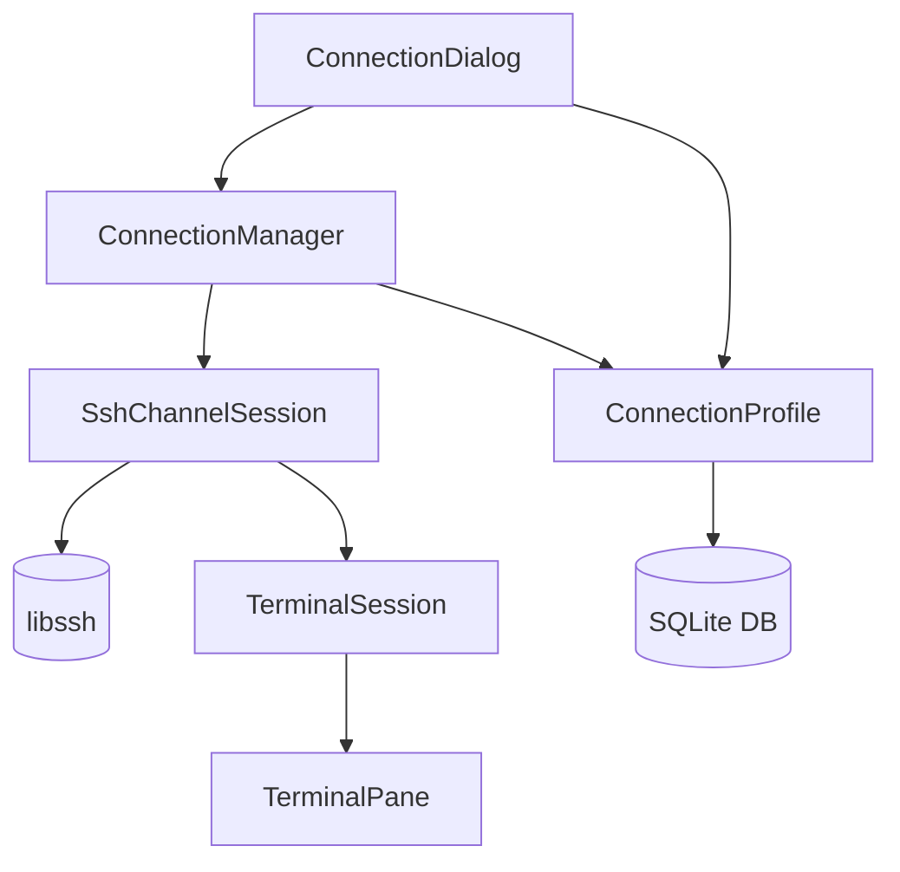

# SSH Remote Connection

Feature Name: ssh-remote-connection
Updated: 2026-05-20

## Description

SSH remote connection module using libssh library to establish secure shell sessions with remote servers. Supports password and public key authentication, connection profile management, and seamless integration with existing terminal pane architecture.

## Architecture



## Components and Interfaces

### SshChannelSession

```cpp
class SshChannelSession : public QObject {
    Q_OBJECT
public:
    bool connect(const SshConfig& config);
    void disconnect();
    void write(const QByteArray& data);
    bool isConnected() const;
    
signals:
    void dataReceived(const QByteArray& data);
    void connected();
    void disconnected();
    void error(const QString& message);
    
private:
    ssh_session m_sshSession;
    ssh_channel m_channel;
};
```

### SshConfig

```cpp
struct SshConfig {
    QString host;
    int port;
    QString username;
    QString password;
    QString privateKeyPath;
    QString passphrase;
    SshAuthMethod authMethod;
};
```

### ConnectionProfile

```cpp
struct ConnectionProfile {
    qint64 id;
    QString name;
    QString host;
    int port;
    QString username;
    SshAuthMethod authMethod;
    QString privateKeyPath;
    QDateTime lastConnected;
};
```

### ConnectionManager

```cpp
class ConnectionManager : public QObject {
    Q_OBJECT
public:
    static ConnectionManager* instance();
    bool initialize();
    
    qint64 saveProfile(const ConnectionProfile& profile);
    bool updateProfile(const ConnectionProfile& profile);
    bool deleteProfile(qint64 id);
    QList<ConnectionProfile> loadProfiles();
    
    SshChannelSession* createSession();
    
signals:
    void profileSaved(qint64 id);
    void profileDeleted(qint64 id);
};
```

## Data Models

### SQLite Schema

```sql
CREATE TABLE IF NOT EXISTS ssh_profiles (
    id INTEGER PRIMARY KEY AUTOINCREMENT,
    name TEXT NOT NULL,
    host TEXT NOT NULL,
    port INTEGER DEFAULT 22,
    username TEXT NOT NULL,
    auth_method TEXT DEFAULT 'password',
    private_key_path TEXT DEFAULT '',
    last_connected TEXT,
    created_at TEXT DEFAULT (datetime('now')),
    updated_at TEXT DEFAULT (datetime('now'))
);
```

## Correctness Properties

1. **Session Uniqueness**: Each SshChannelSession manages one SSH connection
2. **State Consistency**: isConnected() reflects actual SSH channel state
3. **Data Integrity**: Profile data persists across application restarts
4. **Resource Cleanup**: All SSH resources are freed on disconnect

## Error Handling

| Scenario | Strategy |
|----------|----------|
| Connection timeout | Show timeout error, offer retry |
| Authentication failure | Prompt for credentials, allow retry |
| Host key verification | Show host key fingerprint, ask user to accept |
| Network disconnect | Notify user, offer reconnect |
| Invalid private key | Show error, allow selecting different key |

## Test Strategy

1. **Unit Tests**: SshConfig validation, ConnectionProfile CRUD
2. **Integration Tests**: Mock SSH server connection flow
3. **UI Tests**: Connection dialog interaction, profile management

## References

[^1]: libssh Documentation - https://www.libssh.org/documentation/
[^2]: Existing libssh source - src/libssh/
[^3]: TerminalPane - src/Widget/TerminalPane.cpp
